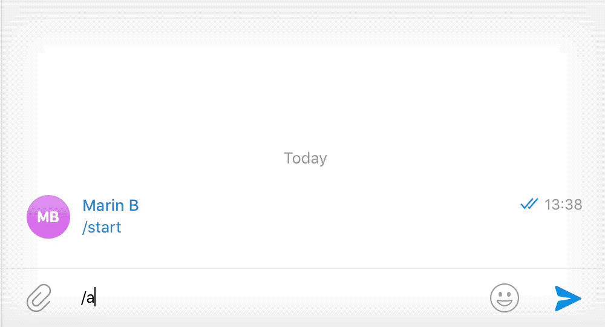

# Appear.in Telegram bot




# Commands

Create random room

`/appear`

Create room with name

`/appear yourRoomName`


# Building
```bash
git clone https://github.com/MarinX/telegram-bots
cd appear
go build
```

# Run

```bash
 TELEGRAM_TOKEN=<your-token> ./appear
```

# License
MIT
