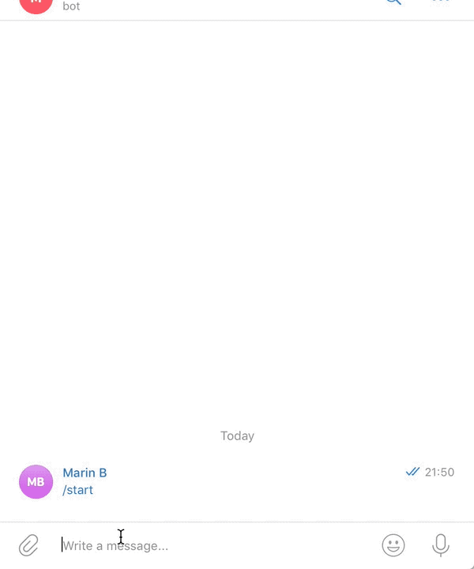

# Blockchain Telegram bot




# Commands

Get Wallet Balance 

`/wallet <address>`

Get QR code

`/payment <address>`

Get latest block 

`/latest_block`

# Building
```bash
git clone https://github.com/MarinX/telegram-bots
cd blockchain
go build
```

# Run

```bash
 TELEGRAM_TOKEN=<your-token> ./blockchain
```

# License
MIT
